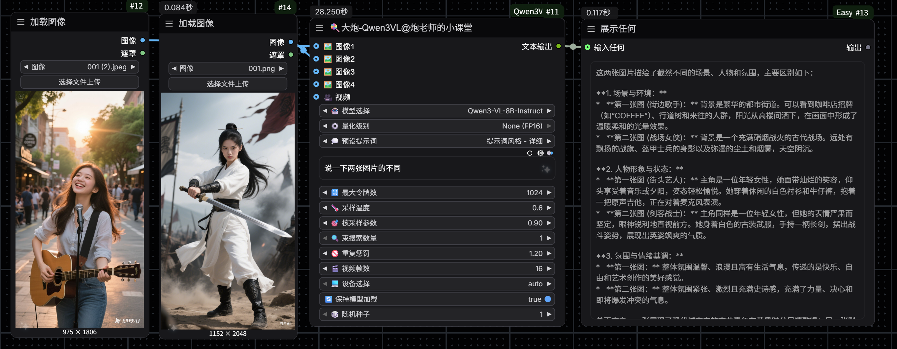
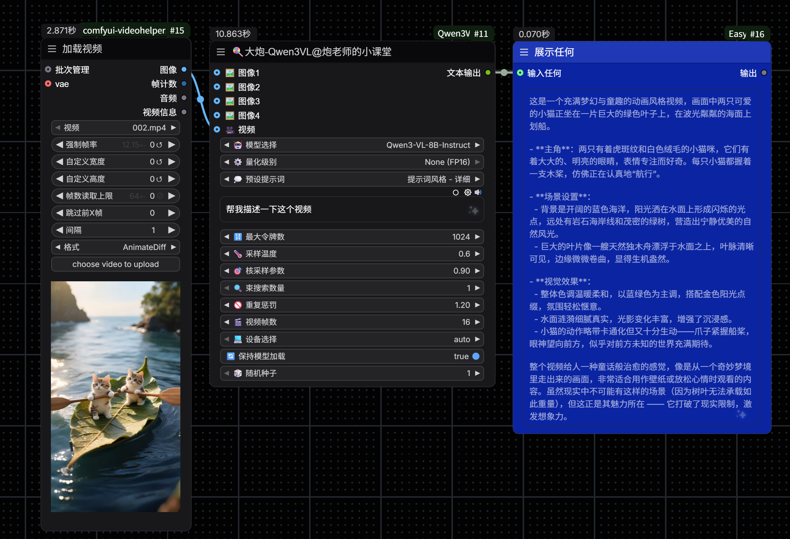
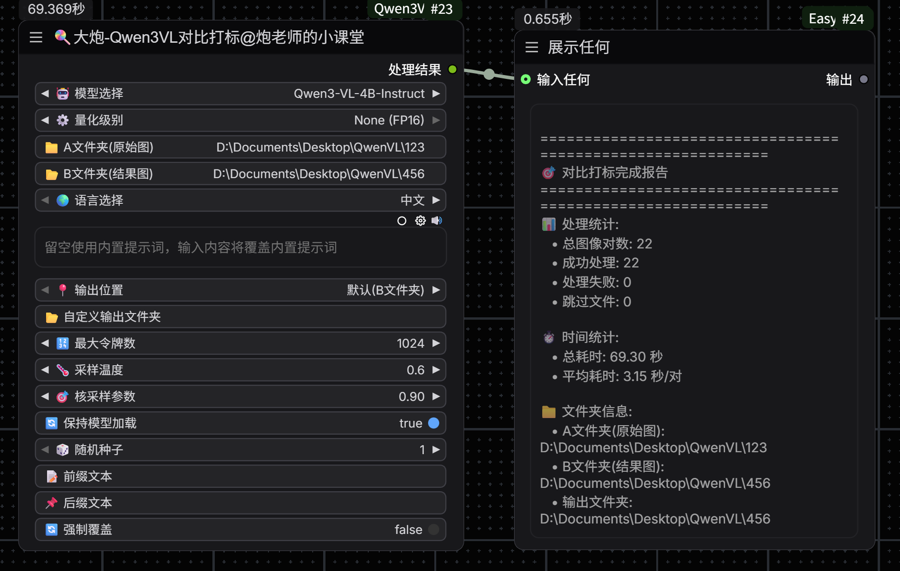
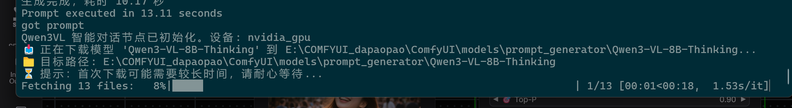

# ComfyUI-Qwen3VL-DP

🍭 **大炮-Qwen3VL** ComfyUI 自定义节点集合，集成了阿里云 Qwen 团队开发的 Qwen3-VL 多模态大语言模型系列。

## 🌟 功能特性

### 🎯 核心能力

- **🖼️ 图像理解**: 详细分析和描述图像内容
- **🎥 视频理解**: 处理视频帧序列，理解视频内容
- **🧠 多模态推理**: 结合视觉和文本信息进行推理
- **✨ 提示词生成**: 为文生图 AI 生成优化的提示词
- **📁 批量处理**: 批量打标和对比分析功能

### 🍧 功能展示
- **🤖 简单反推【单图/多图/视频】**



- **🤖 智能对话【可识图分析】**

- **🤖 文件夹批量打标**

- **🤖 文件夹对比打标【适合kontext/Qwen-edit】**

## 支持的模型
### Qwen3-VL 系列

- **Qwen3-VL-2B-Instruct** / **Qwen3-VL-2B-Thinking**
  - 显存需求: 4GB (FP16) / 2.5GB (8-bit) / 1.5GB (4-bit)
  - FP8 版本: 2.5GB

- **Qwen3-VL-4B-Instruct** / **Qwen3-VL-4B-Thinking** (默认)
  - 显存需求: 6GB (FP16) / 3.5GB (8-bit) / 2GB (4-bit)
  - FP8 版本: 2.5GB

- **Qwen3-VL-8B-Instruct** / **Qwen3-VL-8B-Thinking**
  - 显存需求: 12GB (FP16) / 7GB (8-bit) / 4.5GB (4-bit)
  - FP8 版本: 7.5GB

- **Qwen3-VL-32B-Instruct** / **Qwen3-VL-32B-Thinking**
  - 显存需求: 28GB (FP16) / 14GB (8-bit) / 8.5GB (4-bit)
  - FP8 版本: 24GB

### Qwen2.5-VL 系列 (向后兼容)

- **Qwen2.5-VL-3B-Instruct**: 6GB / 3.5GB / 2GB
- **Qwen2.5-VL-7B-Instruct**: 15GB / 8.5GB / 5GB

### 社区模型

- **Huihui-Qwen3-VL-8B-Instruct-Abliterated**: 12GB / 7GB / 4.5GB
  - ⚠️ **警告**: 此模型已移除安全过滤，可能生成敏感内容
  - 仅用于研究和测试环境
  - 基于 Qwen3-VL-8B 的 abliterated 版本

## 📦 安装指南

### 方法1: Git克隆 (推荐)

```bash
cd ComfyUI/custom_nodes
git clone https://github.com/your-repo/ComfyUI-Qwen3VL-DP.git
cd ComfyUI-Qwen3VL-DP
pip install -r requirements.txt
```

### 方法2: 手动下载

1. 下载项目文件到 `ComfyUI/custom_nodes/ComfyUI-Qwen3VL-DP/`
2. 安装依赖:

```bash
cd ComfyUI/custom_nodes/ComfyUI-Qwen3VL-DP
pip install -r requirements.txt
```

### 重启 ComfyUI

重启 ComfyUI 以加载新节点。

## 🗂️ 模型路径和配置

### 自动下载

首次使用时，模型会自动从 Hugging Face 下载到 ComfyUI 的模型目录：

```
ComfyUI/models/prompt_generator/
```

**工作流程：**
1. 🔍 **检查模型**: 运行节点时，自动检查模型是否已存在
2. 📥 **自动下载**: 如果模型不存在，自动从 Hugging Face 下载
3. ✅ **直接使用**: 如果模型已存在，直接加载使用，不会重复下载

**示例路径：**
- Qwen3-VL-4B-Instruct: `ComfyUI/models/prompt_generator/Qwen3-VL-4B-Instruct/`
- Qwen3-VL-8B-Instruct: `ComfyUI/models/prompt_generator/Qwen3-VL-8B-Instruct/`

### 模型存储空间需求

| 模型 | 完整模型 | 量化版本 |
|------|----------|----------|
| Qwen3-VL-2B | ~4GB | ~2GB |
| Qwen3-VL-4B | ~8GB | ~4GB |
| Qwen3-VL-8B | ~16GB | ~8GB |
| Qwen3-VL-32B | ~64GB | ~32GB |

### 📞 联系方式 📞 
- 作者：@炮老师的小课堂
- 版本：v1.0.1
- 更新日期：2025年
- 作者微信：paolaoshiAICG


## 致谢

- Qwen Team, Alibaba Cloud - 开发 Qwen3-VL 模型
- ComfyUI - 提供强大的节点式 UI 框架
- Hugging Face - 模型托管和 Transformers 库

## 贡献
站在巨人肩膀上！本项目参考以下开源节点：
- https://github.com/1038lab/ComfyUI-QwenVL?tab=readme-ov-file
- https://github.com/EvilBT/ComfyUI_SLK_joy_caption_two


